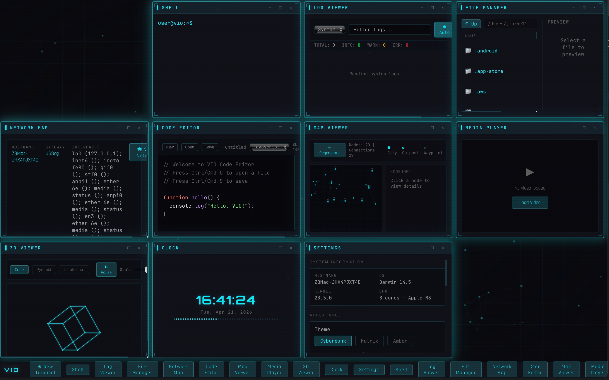

# V I O

> **A desktop environment designed for the AI era.**
> Your computer is no longer just cold icons and folders — it is an intelligent workspace where you talk directly to your machine.

[](LICENSE)
[](https://tauri.app)
[](https://react.dev)
[](https://tauri.app)



## What This Is

Vio is a desktop environment designed for the AI era.

Imagine your computer desktop is no longer just cold icons and folders, but an intelligent workspace. You can pull up system monitoring, check running logs, edit code, analyze network requests, all wrapped in a sci-fi movie visual style.

Go further, and imagine managing multiple AI Agents from a single interface — writing assistants, coding assistants, data analysts — all working independently while you monitor their status in real-time, adjust task priorities, and coordinate collaboration workflows. This is the direction Vio is evolving toward.

Its inspiration comes from computer interfaces in movies like *The Matrix* and *Blade Runner* — dark backgrounds, neon lines, real-time data streams. But now this experience is brought to your macOS, Linux, or Windows computer.

## Highlights

- **Sci-Fi Aesthetics** — Three immersive themes: neon cyan-blue **Cyberpunk**, green code-rain **Matrix**, and retro CRT-style **Amber**.
- **Built-in Tools** — Shell terminal, system monitor, file manager, log viewer, code editor, network scanner, media player, 3D viewer, map viewer, clock widget, and more.
- **Keyboard-First** — Operate every window with shortcuts. Click empty desktop areas to defocus for an immersive experience.
- **Lightweight & Native** — Powered by Tauri 2.0 (Rust) + React. Small footprint, native performance, cross-platform.
- **AI-Native Roadmap** — Evolving toward LLM integration and multi-Agent orchestration. Vio will not only display data, but understand your intentions.

## Who It's For

If you're a solo developer, Vio is your dashboard for debugging products and monitoring system status.

If you're an AI creator, Vio is your console for conversing with models, viewing generation processes, and managing resources.

If you're just a regular person who occasionally uses AI tools to solve work problems, Vio lets you intuitively understand and control your computer without memorizing complex command lines.

Vio believes that in the future, everyone should be able to talk directly to their devices rather than being constrained by graphical interfaces. It is evolving in this direction.

## What It Can Do Now

| Terminal / Tool | Description |
|-----------------|-------------|
| **Shell** | Full terminal via Rust-backed command execution |
| **System Monitor** | Real-time CPU, memory, and process monitoring |
| **File Manager** | Browse and manage your local filesystem |
| **Log Viewer** | Tail and inspect application or system logs |
| **Code Editor** | In-app code editing for quick tweaks |
| **Network Map** | Scan and visualize network topology |
| **Media Player** | Play local media files |
| **3D Viewer** | View 3D models in the browser |
| **Map Viewer** | Geographic map visualization |
| **Clock Widget** | Desktop clock with theme-aware styling |
| **Settings** | Manage themes, preferences, and configuration |

All windows follow a unified visual style with three theme options: neon cyan-blue Cyberpunk, green code rain Matrix, and retro CRT-style Amber.

You can operate windows with keyboard shortcuts or click on empty desktop areas to defocus for an immersive experience.

## Future Direction

Vio's next step is to become an intelligent workstation for human-computer collaboration.

It will integrate browser debugging protocols for direct webpage debugging in Vio; add network packet capture analysis capabilities for real-time HTTP request and protocol inspection; and introduce LLM and AI Agents so Vio can not only display data but also understand your intentions, proactively help troubleshoot problems, and generate solutions.

Furthermore, Vio will evolve toward a multi-Agent environment. You'll be able to manage multiple writing Agents, programming Agents, and data analysis Agents from one interface — viewing their collaboration progress, adjusting task priorities, and making the entire creative and workflow process visual and controllable.

Ultimately, Vio aims to be the vanguard of an AI-native operating system — a personal computing environment that is both lightweight and intelligent, both beautiful and practical.

## Quick Start

Requires Node.js 18+ and Rust toolchain.

```bash
# 1. Clone repository
git clone https://github.com/yourusername/vio.git
cd vio

# 2. Install dependencies
npm install

# 3. Run in development mode
npm run tauri:dev

# 4. Build production version
npm run tauri:build
```

After building, macOS users can find the `.app` file in `src-tauri/target/release/bundle/macos/`, and Windows users can find the installer in `src-tauri/target/release/bundle/msi/`.

## Keyboard Shortcuts

| Shortcut | Function |
|----------|----------|
| `Ctrl/⌘ + T` | Open launcher |
| `Ctrl/⌘ + W` | Close current window |
| `Ctrl/⌘ + M` | Minimize window |
| `Ctrl/⌘ + Shift + M` | Maximize / restore window |
| `Ctrl/⌘ + Tab` | Switch to next window |
| `Ctrl/⌘ + Shift + Tab` | Switch to previous window |
| `Ctrl/⌘ + Number` | Quick open corresponding terminal |
| `Esc` | Close launcher |

Clicking on empty desktop areas can quickly defocus all windows.

## Tech Stack

| Layer | Technology |
|-------|------------|
| Frontend | React 18 + TypeScript + Vite |
| Backend | Rust + Tauri 2.0 |
| Styling | Tailwind CSS |
| State | Zustand |

## License

[MIT License](./LICENSE)
